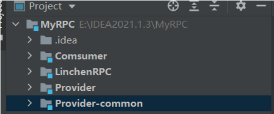
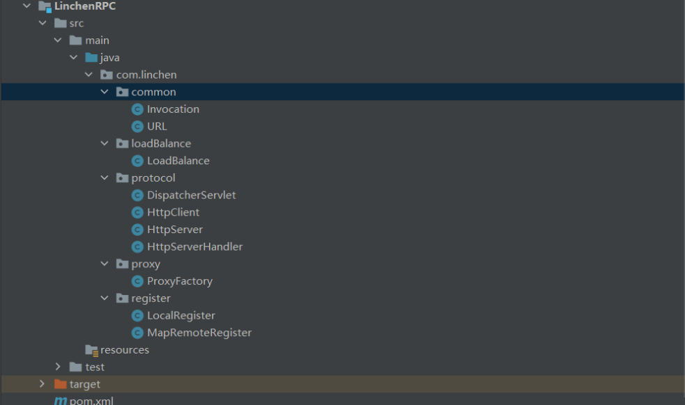
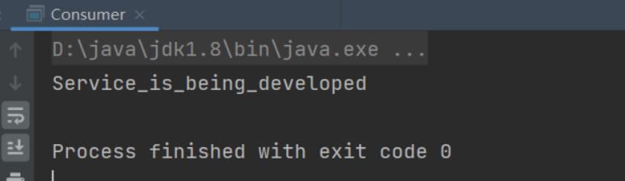
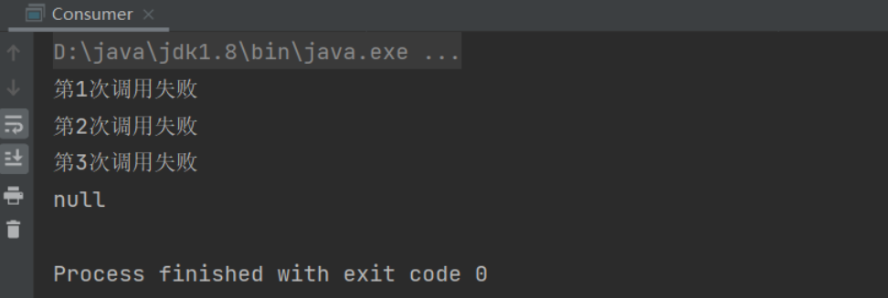
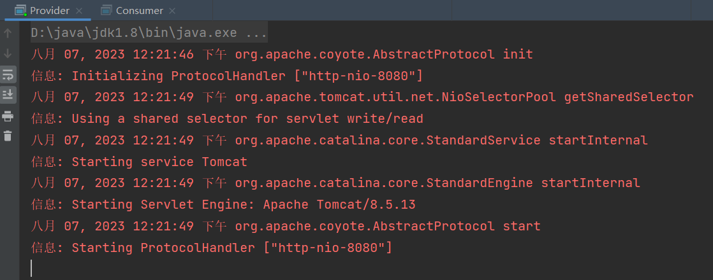
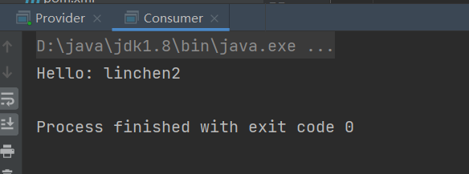
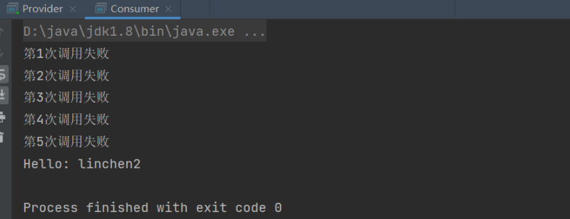

# MyRPC

#### 介绍
自己写的一个简易RPC轮子，服务端采用Tomcat服务器，消费端使用HTTP协议发送网络请求，没有使用专门的服务注册中心，而是使用本地HashMap模拟这种映射关系。

#### 软件架构
软件架构说明



Consumer 包：作为消费者调用服务提供方的接口。

LinchenRPC 包：远程调用过程的一些具体实现细节。

Provider 包：实现需要对外暴露的接口，同时启动一个服务处理调用方的请求。

Provider-common包：Provider所需要实现的接口，便于消费端调用。

#### 实现过程

##### 编写统一接口

```java
package com.linchen;

public interface HelloService {
    public String sayHello(String name);
}

```

作为消费端需要依赖这个模块，直接调用接口方法，就像调用本地接口一样

作为服务提供方需要实现这个接口，可以有不同的实现方案。

##### 编写远程调用过程所需要实现的一些具体细节



###### Invocation：

定义了四个消费端调用远程接口时需要传递的参数，并提供构造器和变量的get、set方法

```java
package com.linchen.common;

import java.io.Serializable;

/**
 * @Author 林晨
 * @Date 2023-08-06 11:19
 * @PackageName:com.linchen.common
 * @ClassName: Invocation
 * @Description: 消费端调用时需要传递的参数
 * @Version 1.0
 */
public class Invocation implements Serializable {
    //接口名
    private String InterfaceName;
    //方法名
    private String methodName;
    //方法类型参数
    private Class[] parameterTypes;
    //方法参数
    private Object[] parameters;

    public Invocation(String interfaceName, String methodName, Class[] parameterTypes, Object[] parameters) {
        InterfaceName = interfaceName;
        this.methodName = methodName;
        this.parameterTypes = parameterTypes;
        this.parameters = parameters;
    }

    public Invocation() {
    }

    public String getInterfaceName() {
        return InterfaceName;
    }

    public void setInterfaceName(String interfaceName) {
        InterfaceName = interfaceName;
    }

    public String getMethodName() {
        return methodName;
    }

    public void setMethodName(String methodName) {
        this.methodName = methodName;
    }

    public Class[] getParameterTypes() {
        return parameterTypes;
    }

    public void setParameterTypes(Class[] parameterTypes) {
        this.parameterTypes = parameterTypes;
    }

    public Object[] getParameters() {
        return parameters;
    }

    public void setParameters(Object[] parameters) {
        this.parameters = parameters;
    }
}

```

###### URL：

定义了服务运行在的主机地址（hostname）与端口号（port）

```java
package com.linchen.common;

import java.io.Serializable;

/**
 * @Author 林晨
 * @Date 2023-08-06 13:36
 * @PackageName:com.linchen.common
 * @ClassName: URL
 * @Description: 定义主机地址与端口号
 * @Version 1.0
 */
public class URL implements Serializable {
    private String hostname;
    private Integer port;

    public URL() {
    }

    public URL(String hostname, Integer port) {
        this.hostname = hostname;
        this.port = port;
    }

    public String getHostname() {
        return hostname;
    }

    public void setHostname(String hostname) {
        this.hostname = hostname;
    }

    public Integer getPort() {
        return port;
    }

    public void setPort(Integer port) {
        this.port = port;
    }
}

```

###### LoadBalance：负载均衡

是自定义的一种负载均衡算法，服务提供方可能搭建了集群，消费端从注册中心（本代码使用本地文件写入的方式实现）可能得到多个服务端地址，自定义负载均衡算法以确定实际对哪个服务端发起调用。我的实现只是一个随机数算法。

```java
package com.linchen.loadBalance;

import com.linchen.common.URL;

import java.util.List;
import java.util.Random;

/**
 * @Author 林晨
 * @Date 2023-08-06 13:57
 * @PackageName:com.linchen.loadBalance
 * @ClassName: LoadBalance
 * @Description: 模拟负载均衡算法
 * @Version 1.0
 */
public class LoadBalance {
    public static URL random(List<URL> urlList){
        Random random = new Random();
        return urlList.get(random.nextInt(urlList.size()));
    }
}

```

###### DispatcherServlet：Servlet容器

Tomcat的Servlet容器，被服务端用于处理调用请求。

```java
package com.linchen.protocol;

import javax.servlet.ServletException;
import javax.servlet.ServletRequest;
import javax.servlet.ServletResponse;
import javax.servlet.http.HttpServlet;
import javax.servlet.http.HttpServletRequest;
import javax.servlet.http.HttpServletResponse;
import java.io.IOException;

public class DispatcherServlet extends HttpServlet {
    @Override
    protected void service(HttpServletRequest req, HttpServletResponse resp) throws ServletException, IOException {
        //此处只是简单调用我们的handler处理方法，这样我们后续如果需要对对请求做出不同的响应时，就可以定义新的handler来处理，降低系统的耦合度
        new HttpServerHandler().handler(req,resp);
    }

}

```

###### HttpServerHandler：处理器

以下实现基于：消费端与服务端达成共识，调用时只会传一个前文所定义的Invocation对象。

```java
package com.linchen.protocol;

import com.linchen.common.Invocation;
import com.linchen.register.LocalRegister;
import org.apache.commons.io.IOUtils;

import javax.servlet.http.HttpServletRequest;
import javax.servlet.http.HttpServletResponse;
import java.io.IOException;
import java.io.ObjectInputStream;
import java.lang.reflect.InvocationTargetException;
import java.lang.reflect.Method;


public class HttpServerHandler {
    public void handler(HttpServletRequest req, HttpServletResponse resp){
        try {
            //从request中获得Invocation对象
            Invocation invocation = (Invocation) new ObjectInputStream(req.getInputStream()).readObject();
            //得到调用的方法名
            String interfaceName = invocation.getInterfaceName();
            //从本地注册中心得到接口的实现类，本地注册中心的实现会在后文给出
            Class classImpl = LocalRegister.get(interfaceName,"1.0");
            //通过反射得到对应的Method对象
            Method method = classImpl.getMethod(invocation.getMethodName(), invocation.getParameterTypes());
            //反射调用方法
            String result = (String)method.invoke(classImpl.newInstance(), invocation.getParameters());
            //将调用结果填入response对象
            IOUtils.write(result,resp.getOutputStream());
        } catch (Exception e) {
            e.printStackTrace();
        }
    }
}

```

###### LocalRegister：接口映射

本地注册中心，映射接口及其实现类

```java
package com.linchen.register;

import java.util.HashMap;
import java.util.Map;

public class LocalRegister {
    //接口名字映射实现类
    private static Map<String,Class> map = new HashMap<>();

    //注册接口实现类，version标识相同接口的不同实现方案
    public static void register(String interfaceName,String version,Class implClass){
        map.put(interfaceName+version,implClass);
    }

    //根据接口与版本号得到对应的实现类
    public static Class get(String interfaceName,String version){
        return map.get(interfaceName+version);
    }
}

```

###### MapRemoteRegister:服务注册与发现

服务端启动时调用：服务注册；消费端请求得到服务端地址：服务发现

```java
package com.linchen.register;

import com.linchen.common.URL;

import java.io.*;
import java.util.ArrayList;
import java.util.HashMap;
import java.util.List;
import java.util.Map;

public class MapRemoteRegister {
    //接口名字映射实现类
    private static Map<String, List<URL>> map = new HashMap<>();

    //注册接口实现类
    public static void register(String interfaceName,URL url){
        List<URL> urls = map.get(interfaceName);
        if(urls==null){
            urls=new ArrayList<>();
        }
        urls.add(url);
        map.put(interfaceName,urls);
        saveFile();
    }

    public static List<URL> get(String interfaceName){
        map=getFile();
        return map.get(interfaceName);
    }

    private static void saveFile(){
        try {
            ObjectOutputStream oos = new ObjectOutputStream(new FileOutputStream("temp.txt"));
            oos.writeObject(map);
            oos.close();
        } catch (IOException e) {
            e.printStackTrace();
        }
    }

    private static Map<String, List<URL>> getFile(){
        try {
            Map<String, List<URL>> map2 = null;
            ObjectInputStream ois = new ObjectInputStream(new FileInputStream("temp.txt"));
            map2 = (Map<String, List<URL>>) ois.readObject();
            return map2;
        } catch (IOException e) {
            e.printStackTrace();
        } catch (ClassNotFoundException e) {
            e.printStackTrace();
        }
        return null;
    }
}

```

###### HttpServer：服务启动

服务提供方启动一个Tomcat服务器

```java
package com.linchen.protocol;

import org.apache.catalina.*;
import org.apache.catalina.connector.Connector;
import org.apache.catalina.core.StandardContext;
import org.apache.catalina.core.StandardEngine;
import org.apache.catalina.core.StandardHost;
import org.apache.catalina.startup.Tomcat;

public class HttpServer {
    public void start(String hostname,Integer port){
        Tomcat tomcat = new Tomcat();

        Server server = tomcat.getServer();
        Service service = server.findService("Tomcat");

        Connector connector = new Connector();
        connector.setPort(port);

        Engine engine = new StandardEngine();
        engine.setDefaultHost(hostname);

        Host host = new StandardHost();
        host.setName(hostname);

        String contextPath = "";
        Context context = new StandardContext();
        context.setPath(contextPath);
        context.addLifecycleListener(new Tomcat.FixContextListener());

        host.addChild(context);
        engine.addChild(host);

        service.setContainer(engine);
        service.addConnector(connector);
		
        //注册我们自定义的servlet容器
        tomcat.addServlet(contextPath,"dispatcher",new DispatcherServlet());
        context.addServletMappingDecoded("/*","dispatcher");

        try {
            tomcat.start();
            tomcat.getServer().await();
        } catch (LifecycleException e) {
            e.printStackTrace();
        }
    }
}

```

###### HttpClient：网络请求

服务消费端向服务端发起网络请求

```java
package com.linchen.protocol;

import com.linchen.common.Invocation;
import org.apache.commons.io.IOUtils;

import java.io.*;
import java.net.HttpURLConnection;
import java.net.MalformedURLException;
import java.net.URL;

public class HttpClient {
    public String send(String hostname, Integer port, Invocation invocation) throws Exception{
		
        //主机与端口配置
        URL url = new URL("http",hostname,port,"/");
        HttpURLConnection httpURLConnection = (HttpURLConnection) url.openConnection();

        httpURLConnection.setRequestMethod("POST");
        httpURLConnection.setDoOutput(true);

        OutputStream outputStream = httpURLConnection.getOutputStream();
        ObjectOutputStream oos = new ObjectOutputStream(outputStream);
		
        //请求体
        oos.writeObject(invocation);
        oos.flush();
        oos.close();

        InputStream inputStream = httpURLConnection.getInputStream();
        String result = IOUtils.toString(inputStream);
        return result;
    }
}

```

###### ProxyFactory：代理工厂

服务调用方请求代理工厂以获得目标接口的代理对象，封装了网络请求过程的一些实现细节

```java
package com.linchen.proxy;

import com.linchen.common.Invocation;
import com.linchen.common.URL;
import com.linchen.loadBalance.LoadBalance;
import com.linchen.protocol.HttpClient;
import com.linchen.register.MapRemoteRegister;

import java.lang.reflect.InvocationHandler;
import java.lang.reflect.Method;
import java.lang.reflect.Proxy;
import java.util.List;

/**
 * @Author 林晨
 * @Date 2023-08-06 13:26
 * @PackageName:com.linchen.proxy
 * @ClassName: ProxyFactory
 * @Description: TODO
 * @Version 1.0
 */
public class ProxyFactory {
    //泛型定义方法
    public static <T> T getProxy(Class interfaceClass){
        Object proxyInstance = Proxy.newProxyInstance(interfaceClass.getClassLoader(), new Class[]{interfaceClass}, new InvocationHandler() {
            @Override
            public Object invoke(Object proxy, Method method, Object[] args) throws Throwable {
                //服务提供方尚未开发完成的处理：mock
                //有时候提供方尚未完善，但是消费端的编码仍然需要进行，此时可以配置JVM参数直接返回：
                //-Dmock=return:Service_is_being_developed
                String mock = System.getProperty("mock");
                if(mock!=null && mock.startsWith("return")){
                    String result = mock.replaceAll("return:", "");
                    return result;
                }
				//将参数封装成Invocation对象
                Invocation invocation = new Invocation(interfaceClass.getName(),
                        method.getName(), method.getParameterTypes(), args);
                HttpClient httpClient = new HttpClient();

                //服务发现，得到可能的多台服务提供方
                List<URL> urlList = MapRemoteRegister.get(interfaceClass.getName());
                //服务调用
                String result = null;
                //调用过程可能存在重试
                int max = 0;
                while(max!=3){
                    try{
                        //负载均衡
                        URL url = LoadBalance.random(urlList);
                        result = httpClient.send(url.getHostname(), url.getPort(), invocation);
                        break;
                    }catch (Exception e){
                        //重试
                        if(max++ !=3){
                            System.out.println("第"+max+"次调用失败");
                            continue;
                        }
                        System.out.println("服务调用过程失败");
                    }
                }
                return result;
            }
        });
        return (T) proxyInstance;
    }
}

```

##### 服务提供方：

###### 实现接口：两种方案

```java
package com.linchen;

public class HelloServiceImpl implements HelloService{
    @Override
    public String sayHello(String name) {
        return "Hello: "+name;
    }
}

```

```java
package com.linchen;


public class HelloServiceImpl2 implements HelloService{
    @Override
    public String sayHello(String name) {
        return "Hello2: "+name;
    }
}

```

###### Provider：启动服务

```java
package com.linchen;

import com.linchen.common.URL;
import com.linchen.protocol.HttpServer;
import com.linchen.register.LocalRegister;
import com.linchen.register.MapRemoteRegister;


public class Provider {
    public static void main(String[] args) {
        //本地接口注册
        LocalRegister.register(HelloService.class.getName(),"1.0",HelloServiceImpl.class);
        LocalRegister.register(HelloService.class.getName(),"2.0",HelloServiceImpl2.class);

        //服务注册
        URL url = new URL("localhost",8080);
        MapRemoteRegister.register(HelloService.class.getName(),url);

        HttpServer httpServer = new HttpServer();
        httpServer.start("localhost",8080);
    }
}

```

此时可以启动服务端了

##### 消费者Consumer：

```java
package com.linchen;

import com.linchen.common.Invocation;
import com.linchen.protocol.HttpClient;
import com.linchen.proxy.ProxyFactory;

public class Consumer {
    public static void main(String[] args) {
        //调用RPC工厂得到接口的代理对象
        HelloService helloService = ProxyFactory.getProxy(HelloService.class);
        //使用代理对象调用接口，就像调用本地方法一样
        String result2 = helloService.sayHello("linchen2");
        System.out.println(result2);
    }
}

```

#### 测试

###### 1.服务端配置了消费端未完成的JVM参数：

-Dmock=return:Service_is_being_developed



消费端没有真正发起网络请求调用服务，而是直接返回

###### 2.删掉上述配置，但是不启动服务端



可以看到进入了我们的服务重试部分，配置的最大重试次数是3次，在三次调用失败后，打印的返回结果自然为null

###### 3.先启动服务端，再启动消费端



服务端成功启动



###### 4.先启动消费端，中途启动服务端



可以看到在五次调用失败后，第六次成功调用并得到返回结果

